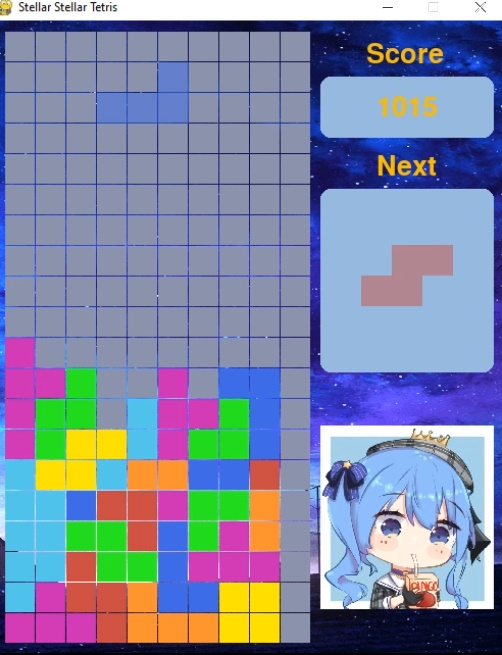

# Stellar_Stellar_Tetris

This project utilizes full python/pygame to create a fun game of Tetris. The process of this project was to practice OOP with python 
by creating the game tetris and to practice utilizing pygame to create games.

##  How to play
- Download the github zip and launch main.exe (windows device only currently)
- Other OS run main.py on any IDE to play 

##  Controls
- A key to move Left 
- D key to move right
- S key to move down
- Spacebar key to hard-drop
- J key to rotate

## Preview

